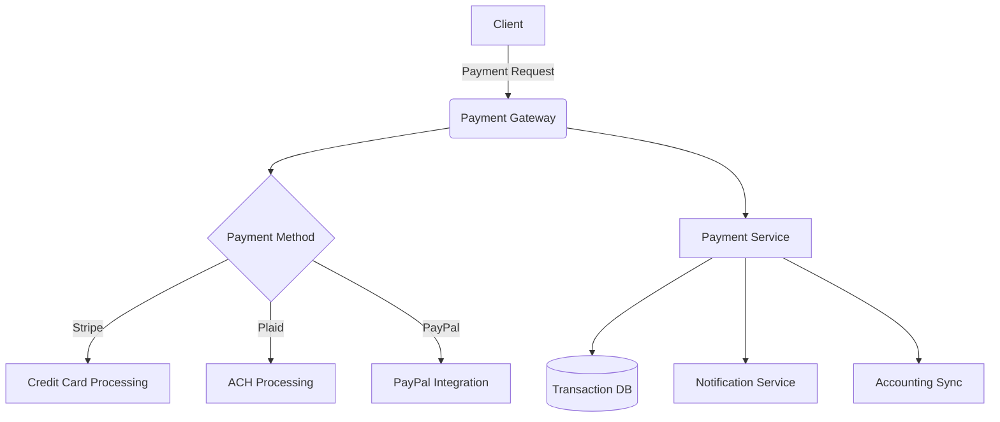

# Unified Payment System Design

## Core Requirements
1. Support multiple payment methods (credit cards, ACH, PayPal)
2. Handle split payments (deposit + final payment)
3. Support package purchases
4. Compliance with PCI DSS standards
5. Reconciliation with accounting systems

## Architecture Components


## Data Model
```typescript
interface PaymentTransaction {
  id: string;
  amount: number;
  currency: string;
  status: 'pending' | 'completed' | 'failed' | 'refunded';
  method: 'card' | 'ach' | 'paypal' | 'other';
  customerId: string;
  invoiceId?: string;
  packageId?: string;
  splitPayment?: {
    isSplit: boolean;
    totalAmount: number;
    payments: Array<{
      amount: number;
      dueDate: string;
      status: 'pending' | 'paid';
    }>;
  };
  createdAt: Date;
  updatedAt: Date;
}
```

## API Endpoints
1. `POST /api/payment/create` - Initiate payment
2. `POST /api/payment/confirm` - Confirm payment completion
3. `GET /api/payment/methods` - List available methods
4. `POST /api/payment/webhook` - Handle payment provider webhooks

## Security Considerations
- Tokenization of sensitive data
- PCI compliance through Stripe Elements
- Audit logging for all transactions
- Fraud detection rules

## Implementation Phases
1. **Phase 1 (2 weeks):** Stripe integration + basic flows
2. **Phase 2 (1 week):** Split payment support
3. **Phase 3 (1 week):** PayPal integration
4. **Phase 4 (2 weeks):** Advanced reporting & reconciliation
