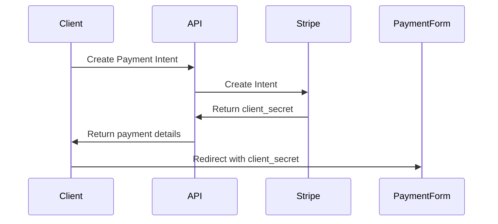
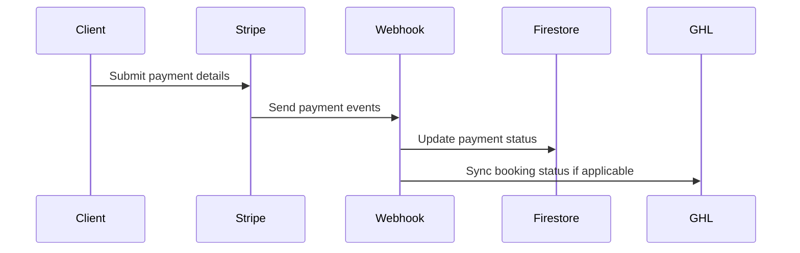

# Payment System Documentation

## Architecture Overview
- **Frontend Components**:
  - `PaymentForm` - Reusable payment form
  - `PackageCheckoutWithPayment` - Package checkout flow
  - `BookingPaymentStep` - Booking integration
- **Backend Services**:
  - `StripeService` - Handles Stripe API interactions
  - Payment Intent API - Creates payment intents
  - Webhook Endpoint - Processes Stripe events

## Key Flows
### 1. Payment Initialization

### 2. Payment Processing

## Integration Points
- **Bookings**: Automatically processes deposits
- **Packages**: Handles package purchases
- **CRM**: Syncs payment status with GoHighLevel

## Error Handling
- Client-side validation
- Stripe error messages
- Webhook retry logic

## Security Considerations
- Never expose Stripe keys client-side
- Validate webhook signatures
- Secure Firestore payment records
