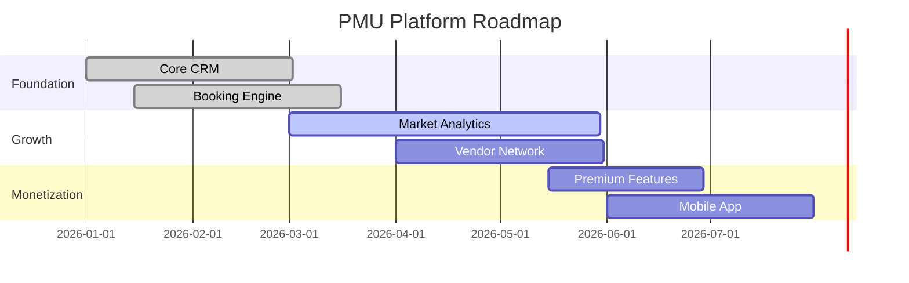

# PMU Business Platform - Business Model Canvas

## 1. Value Propositions
**Core:**
- All-in-one business management for PMU artists
- Built-in local market intelligence (OpenClaw)
- AI-powered growth recommendations

**Differentiators:**
- Vertical-specific workflows
- Automated vendor/event matching
- Solo-owner optimization

## 2. Customer Segments
**Primary:**
- Solo PMU artists
- Small PMU studios (1-3 artists)

**Secondary:**
- PMU trainers/educators
- Product vendors

## 3. Channels
- Direct sales (website)
- Industry partnerships
- Social media marketing
- Artist referral program

## 4. Customer Relationships
- Onboarding consultation
- AI-assisted optimization
- Local community building
- Premium support tiers

## 5. Revenue Streams
- Monthly subscriptions ($29-$99)
- Marketplace commissions (5-15%)
- Premium AI advisor ($49/month)
- One-time setup fees

## 6. Key Resources
- OpenClaw API access
- AI training datasets
- Artist community
- Payment infrastructure

## 7. Key Activities
- Platform development
- Data analysis
- Partner onboarding
- Artist education

## 8. Key Partnerships
- OpenClaw (data)
- PMU product vendors
- Industry associations
- Payment processors

## 9. Cost Structure
- Cloud infrastructure
- AI model training
- Sales/marketing
- Customer support

## 10. Implementation Timeline

