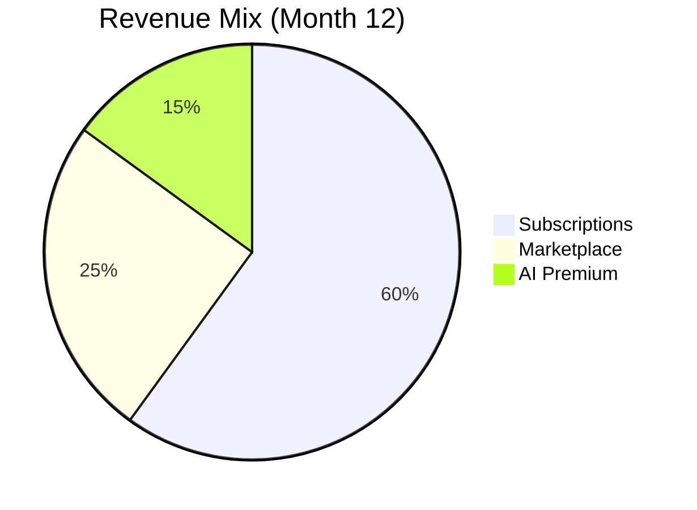

# 12-Month Financial Projections

## Revenue Model

## Monthly Projections
| Month | Users | MRR | Expenses | Net |
|-------|-------|-----|----------|-----|
| 1 | 50 | $1,450 | $8,200 | -$6,750 |
| 2 | 85 | $2,465 | $7,800 | -$5,335 |
| 3 | 130 | $3,770 | $7,500 | -$3,730 |
| 4 | 200 | $5,800 | $8,200 | -$2,400 |
| 5 | 300 | $8,700 | $9,000 | -$300 |
| 6 | 450 | $13,050 | $9,500 | $3,550 |
| 7 | 650 | $18,850 | $10,200 | $8,650 |
| 8 | 900 | $26,100 | $11,000 | $15,100 |
| 9 | 1,200 | $34,800 | $12,000 | $22,800 |
| 10 | 1,600 | $46,400 | $13,500 | $32,900 |
| 11 | 2,100 | $60,900 | $15,000 | $45,900 |
| 12 | 2,700 | $78,300 | $16,500 | $61,800 |

## Key Assumptions
- **User Growth:** 15-20% monthly
- **Churn Rate:** 5% monthly
- **Average Revenue Per User (ARPU):** $29 (scaling to $36 with premium)
- **Customer Acquisition Cost (CAC):** $120 (declining to $80)

## Investment Requirements
| Phase | Amount | Purpose |
|-------|--------|---------|
| Development | $25,000 | Core platform build |
| Marketing | $15,000 | Launch campaigns |
| Reserve | $10,000 | Contingency |
| **Total** | **$50,000** | |

## Break-even Analysis
- Projected break-even: Month 6
- Payback period: 10 months
- Year 1 EBITDA: $182,000
